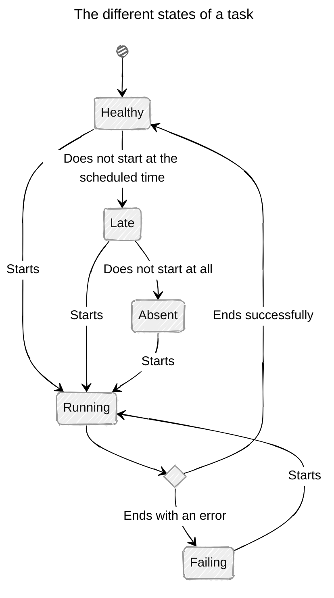

::lead
Learn more about how tasks work and the different states a task can be in.
::

At any given time, a task is in exactly one of several possible states. A task transitions from one state to another in response to an event; for example, starting a task changes its state to *Running*.

This page lists all possible states for a task and the conditions that cause the task to transition from one state to another.

### Healthy

This is the default state for a newly created task. It represents the state of a task for which no failure is reported.

##### Possible Transitions:

- The task starts: transition to :TaskStatusLabel{size="sm" status="running"}
- The task does not start at the scheduled time: transition to :TaskStatusLabel{size="sm" status="late"}

### Running

This is the state of a task that is currently running. During the execution of a task, it is possible to send execution logs (logs) to retrieve them later on the dashboard for debugging the task.

It is also necessary to send *heartbeats* regularly to confirm that the task is still running. Without a regular heartbeat, the task is considered stopped. Thus, if the machine running the task fails, or if the connection to the platform is lost, making it impossible to know if the task completed successfully, an incident will be created.

The command-line tool takes care of sending the logs and heartbeats automatically.

**Only one execution can be running for a given task**, in other words, a task can be *Running* or not, but it cannot be *Running* multiple times at the same time. The command-line tool and the API will refuse to mark a task as *Running* if it is already running. If you need to track multiple parallel executions, you must use different tasks.

##### Possible Transitions:

- The task stops successfully: transition to :TaskStatusLabel{size="sm" status="healthy"}
- The task stops with an error: transition to :TaskStatusLabel{size="sm" status="failing"}
- DutyDuck no longer receives heartbeats for the task for a certain time: transition to :TaskStatusLabel{size="sm" status="failing"}

### Late

State of a scheduled task that did not start at the expected time but has not yet exceeded its lateness window.

##### Possible Transitions:

- The task starts: transition to :TaskStatusLabel{size="sm" status="running"}
- The task does not start and exceeds its lateness window: transition to :TaskStatusLabel{size="sm" status="absent"}

### Absent

State of a scheduled task that did not start at the expected time and has exceeded its lateness window.

##### Possible Transitions:

- The task starts: transition to :TaskStatusLabel{size="sm" status="running"}

### Failing

State of a task that has failed, either because it ended with an error or because we stopped receiving heartbeats for the task, and consequently, we cannot determine if the task completed successfully.

##### Possible Transitions:

- The task starts: transition to :TaskStatusLabel{size="sm" status="running"}

---

### Archiving a Task

In addition to the states already mentioned, a task can be permanently archived by a user using the dedicated button on the dashboard or the API.

When a task is :TaskStatusLabel{size="sm" status="archived"}, its state can no longer be modified by the API, it is no longer possible to run the task, and its start time, if it was a scheduled task, is no longer monitored by DutyDuck.

The task ID can be reused by a new task.

### Summary

The whole can be summarized by the following diagram:
